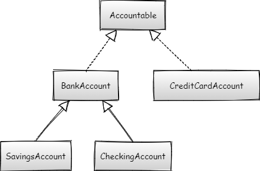

# Polymorphism exercise

The purpose of this exercise is to practice writing code that uses the Object-Oriented Programming principle of polymorphism.

## Learning objectives

After completing this exercise, you'll be able to:

- Explain the concept of polymorphism and how it's useful
- Understand where inheritance can assist in writing polymorphic code
- State the purpose of interfaces and how they're used
- Use polymorphism through inheritance using IS-A relationships
- Use polymorphism through interfaces using CAN-DO relationships

## Getting started

- Open the polymorphism exercise in IntelliJ.
- Complete the appropriate classes to satisfy the requirements.

## Evaluation criteria and functional requirements

- The project must not have any build errors.
- Code is in a clean, organized format.
- Code is appropriately encapsulated.
- Code uses polymorphism appropriately to avoid code duplication.
- The code meets the specifications defined in the remainder of this document.

### Bank customer application

**Notes for all classes and interfaces**
- "X" in the set column indicates it *must have a setter*.
- "Derived" in the set column indicates the attribute is a derived property and don't require a setter.

### Instructions

This code extends from the previous unit's exercise. The bank account classes work well, but now the bank needs to calculate a customer's total assets to assign them VIP status if they have $25,000 or more in assets at the bank.

The bank is also introducing credit cards. Since credit cards aren't strictly bank accounts that store money, they don't inherit from the `BankAccount` class. However, you must still account for them in the VIP calculation.

For this exercise, you'll add new features to the code to create a `BankCustomer` class that has multiple accounts. You'll also create a new type of account: a credit card account. A credit card account isn't a `BankAccount`, but you must store it with the customer as one of their accounts. To do this, you need to create a new interface that specifies that an object is "accountable" and has a `getBalance()` method.

For this exercise, you'll:

1. Add a new method to allow customers to transfer money between `BankAccount`s.
2. Create a new interface called `Accountable`.
3. Make `BankAccount` implement `Accountable`.
4. Create a new class called `CreditCardAccount` that's also `Accountable`.
5. Create a `BankCustomer` class that has many `Accountable` objects.
6. Add an `isVip()` method to `BankCustomer`.

#### Step One: Add a new `transferFunds()` method to transfer money between `BankAccount`s

Add the following method to allow `BankAccount`s to transfer money to another `BankAccount`. Where would you add this method to make sure it works the same for all `BankAccount`s, including `SavingsAccount` and `CheckingAccount`?

| Method Name                                                         | Return Type | Description                                                                             |
| ------------------------------------------------------------------- | ----------- | --------------------------------------------------------------------------------------- |
| `transferFunds(BankAccount destinationAccount, int transferAmount)` | `int`       | Withdraws `transferAmount` from this account and deposits it into `destinationAccount`. Returns the new balance of the "from" account. |

All tests in `Step1_TransferFundsTest` pass when this section is complete.

#### Step Two: Create the `Accountable` interface and make `BankAccount` implement it

The `Accountable` interface means that an object can be used in the accounting process for the customer.

| Method Name    | Return Type | Description                                          |
| -------------- | ----------- | ---------------------------------------------------- |
| `getBalance()` | `int`       | Returns the balance value of the account in dollars. |

Add the `Accountable` interface to `BankAccount`. This makes `BankAccount`, and all the classes that inherit from `BankAccount`, "accountable" classes.

All tests in `Step2_AccountableTest` pass when this section is complete.

#### Step Three: Implement a new `CreditCardAccount` class

A `CreditCardAccount` isn't a `BankAccount` but "can-do" `Accountable`.

| Constructor                                                         | Description                                                                                                            |
| ------------------------------------------------------------------- | ---------------------------------------------------------------------------------------------------------------------- |
| `CreditCardAccount(String accountHolderName, String cardNumber)` | A new credit card account requires an account holder name and card number. The debt defaults to a 0 dollar balance. |

| Attribute Name      | Data Type | Get     | Set | Description                                                                                      |
| ------------------- | --------- | ------- | --- | ------------------------------------------------------------------------------------------------ |
| `accountHolderName` | `String`  | X       |     | The account holder name that the account belongs to.                                             |
| `cardNumber`        | `String`  | X       |     | The credit card number for the account.                                                          |
| `debt`              | `int`     | X       |     | The amount the customer owes.                                                                    |
| `balance`           | `int`     | Derived |     | Required property of the `Accountable` interface. Returns the `debt` value as a negative number. |

| Method Name                  | Return Type | Description                                                                                                               |
| ---------------------------- | ----------- | ------------------------------------------------------------------------------------------------------------------------- |
| `pay(int amountToPay)`       | `int`       | Subtracts `amountToPay` from the amount owed. Returns the new total amount owed. `amountToPay` must be greater than zero. |
| `charge(int amountToCharge)` | `int`       | Adds `amountToCharge` to the amount owed. Returns the new total amount owed. `amountToCharge` must be greater than zero.  |

> Note: Be sure to implement the interface. The balance for the accounting must be the debt as a negative number.

All tests in `Step3_CreditCardTest` pass when this section is complete.

#### Step Four: Implement the `BankCustomer` class

Implement the `BankCustomer` class. A bank customer has a list of `Accountable`s.

| Attribute Name | Data Type           | Get      | Set      | Description                                          |
| -------------- | ------------------- | -------- | -------- | ---------------------------------------------------- |
| `name`         | `String`            | X        | X        | The account holder name that the account belongs to. |
| `address`      | `String`            | X        | X        | The address of the customer.                         |
| `phoneNumber`  | `String`            | X        | X        | The phone number of the customer.                    |
| `accounts`     | `List<Accountable>` | See note | See note | The list of a customer accountable items.            |

Note: `accounts` is a `private` member of the class and isn't exposed with a typical getter and setter. The `GetAccounts()` method acts as the getter and must return the list as an _array_. The `AddAccount()` method doesn't overwrite the `accounts` like a setter, it only adds an account to the list.

| Method Name                          | Return Type     | Description                                           |
| ------------------------------------ | --------------- | ----------------------------------------------------- |
| `getAccounts()`                      | `Accountable[]` | Returns an array of the customer's accounts.          |
| `addAccount(Accountable newAccount)` | `void`          | Adds `newAccount` to the customer's list of accounts. |

All tests in `Step4_BankCustomerTest` pass when this section is complete.

#### Step Five: Add the `isVip()` method to the `BankCustomer` class

The bank considers customers whose combined account balances (balances in bank accounts minus debts from credit card accounts) of at least $25,000 as VIP customers and receive special privileges.

Add a method called `isVip()` to the `BankCustomer` class that returns `true` if the sum of all accounts belonging to the customer is at least $25,000, otherwise returns `false`.

All tests in `Step5_IsVipTest` pass when this section is complete.
