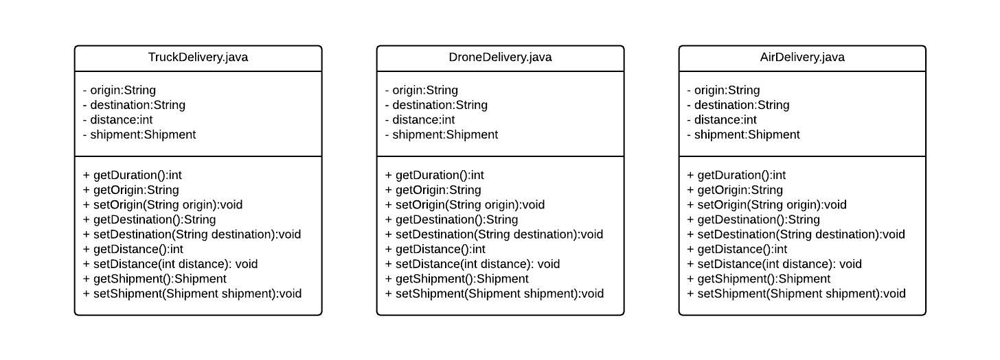
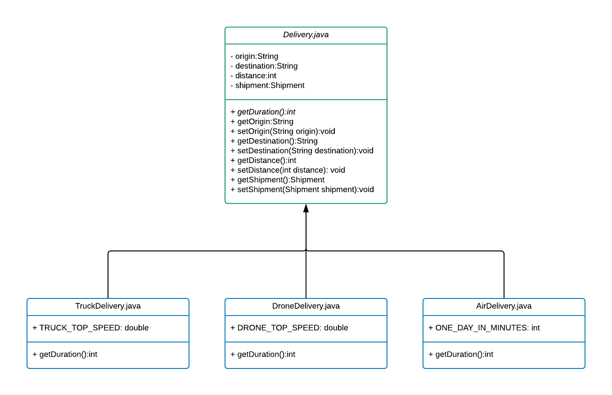

# Tutorial for managing inheritance

In this tutorial, you'll be working on classes for a shipping company. You'll create new classes for several delivery options, and use the `abstract`, `final`, and `protected` keywords to require and restrict inheritance.

To get started, open the tutorial project in IntelliJ. It includes a basic `Shipment` class to represent a package for delivery, and a `Demo` class that you'll use later in the tutorial.

## Design

The company wants to offer the following delivery options:

- Truck Delivery
- Drone Delivery
- Air Delivery

Each delivery option has the following properties:

- origin : `String` _(the origin of the shipment)_
- destination : `String` _(the destination of the shipment)_
- distance : `int` _(the distance between the origin and destination in miles)_
- shipment: `Shipment`_(the object representing the package for delivery)_

Each delivery option has the following methods:

- `getDuration()`
- getters & setters for each property

What makes each of these types of deliveries unique is the time that it takes to make the delivery. A truck driving across the country takes a lot longer than the Air Delivery. Since each delivery type is unique, each class has a different implementation of the `getDuration()` method.

If you were to jump right in and start writing code without any planning, you might end up with the following three classes:



Notice how similar all those classes are. Duplicate code is a red flag - there's probably a better way to design your application. In this case, each of the classes share state - also known as properties - but have one method `getDuration()` that's unique. This is a great opportunity to use an abstract class. A better approach might look like this:



## Step One: Create the `Delivery` class

Now that you have a good idea of what your application looks like, you can write some code. Start by creating a new package named `com.shippingcompany.delivery` and create a new class `Delivery.java`. Then, create four properties and all of the getters and setters for each:

```java
package com.shippingcompany.delivery;

import com.shippingcompany.Shipment;

public class Delivery {

    private String origin;
    private String destination;
    private int distance;
    private Shipment shipment;

    public String getOrigin() {
        return origin;
    }

    public void setOrigin(String origin) {
        this.origin = origin;
    }

    public String getDestination() {
        return destination;
    }

    public void setDestination(String destination) {
        this.destination = destination;
    }

    public int getDistance() {
        return distance;
    }

    public void setDistance(int distance) {
        this.distance = distance;
    }

    public Shipment getShipment() {
        return shipment;
    }

    public void setShipment(Shipment shipment) {
        this.shipment = shipment;
    }

}
```

Next, you need to declare a  `getDuration()` method without providing any implementation, but require any class that extends `Delivery` to implement it. To do this, make it an abstract method:

```java
public abstract int getDuration();
```

Only abstract classes can contain abstract methods, so after adding the `abstract` keyword to a method, the IDE marks it as an error until you also add the `abstract` keyword to the class. Making the class abstract means you can't create instances of this class--using it requires inheriting from it. After that, your `Delivery` class looks like this:

```java
package com.shippingcompany.delivery;

import com.shippingcompany.Shipment;

public abstract class Delivery {

  private String origin;
  private String destination;
  private int distance;
  private Shipment shipment;

  public abstract int getDuration();

  //getters and setters...
}
```

## Step Two: Create the `TruckDelivery` class

Now that you have the base `Delivery` class, you can create the class for the truck delivery option. In the `com.shippingcompany.delivery` package, create a new class named `TruckDelivery` that extends the `Delivery` class.

```java
public class TruckDelivery extends Delivery {
    
}
```

You'll see an error at this point, because this class doesn't yet provide an implementation for `getDuration()`. By making that method abstract, you've ensured that every child class implements the method--they won't compile until they do.

For the sake of simplicity, assume trucks always drive at their top speed of 60 mph. If the truck goes at that speed across the whole distance, you can determine how long it would take to complete the delivery with this implementation of `getDuration()`:

```java
package com.shippingcompany.delivery;

public class TruckDelivery extends Delivery {

    /**
     * The top speed of the truck represented in mph
     */
    public static final double TRUCK_TOP_SPEED = 60.0;

    @Override
    public int getDuration() {
        // time = distance / rate
        double decimalHours = (double) super.getDistance() / TRUCK_TOP_SPEED;
        int hours = (int) decimalHours;
        int minutes = (int) Math.round((decimalHours - hours) * 60);
        return hours * 60 + minutes; //duration in minutes
    }

}
```

## Step Three: Create the `DroneDelivery` and `AirDelivery` classes

Next, create the `DroneDelivery` and `AirDelivery` classes in the`com.shippingcompany.delivery` package the same way you created the `TruckDelivery` class.

Drone delivery works like the truck delivery option with a little wrinkle. The smallest delivery drones have a top speed of 100 mph, but can only carry 1 pound packages. As the total weight of the shipment increases, larger, slower drones are necessary, which this method represents by dividing the top speed by the weight:

```java
package com.shippingcompany.delivery;

public class DroneDelivery extends Delivery {

    /**
     * The top speed of the drone represented in mph
     */
    public static final double DRONE_TOP_SPEED = 100.0;

    @Override
    public int getDuration() {
        int weight = super.getShipment().getWeight();
        double topSpeedWithWeight = DRONE_TOP_SPEED / weight;
        double decimalHours = super.getDistance() / topSpeedWithWeight;
        int hours = (int) decimalHours;
        int minutes = (int) Math.round((decimalHours - hours) * 60);
        return hours * 60 + minutes; //duration in minutes
    }
}
```

All air deliveries take one day. Remember that `getDuration()` method returns minutes, so you need to convert one day to minutes:

```java
package com.shippingcompany.delivery;

public class AirDelivery extends Delivery {

    public static final int ONE_DAY_IN_MINUTES = 24 * 60;

    @Override
    public int getDuration() {
        return ONE_DAY_IN_MINUTES;
    }
}
```

At this point, you've created an abstract class and three classes that inherit from it. By making `getDuration()` an abstract method, you required each of those child classes to provide their own implementation for it.

## Step Four: Add an `hoursToMinutes()` method

Notice that both the `TruckDelivery` and `DroneDelivery` classes convert hours into minutes in their `getDuration()` methods, using exactly the same code. That's an opportunity to refactor that code and move it into the `Delivery` class. Add the following method to the `Delivery` class:

```java
public int convertHoursToMinutes(double decimalHours) {
    int hours = (int) decimalHours;
    int minutes = (int) Math.round((decimalHours - hours) * 60);
    return hours * 60 + minutes; //duration in minutes
}
```

Then, refactor the `getDuration()` method of `TruckDelivery` like this:

```java
public int getDuration() {
    double decimalHours = (double) super.getDistance() / TRUCK_TOP_SPEED;
    return convertHoursToMinutes(decimalHours);
}
```

And then refactor the `getDuration()` method of `DroneDelivery` like this:

```java
public int getDuration() {
    int weight = super.getShipment().getWeight();
    double topSpeedWithWeight = DRONE_TOP_SPEED / weight;
    double decimalHours = super.getDistance() / topSpeedWithWeight;
    return convertHoursToMinutes(decimalHours);
}
```

Go to the `main()` method in the `Demo` class, and create an instance of `TruckDelivery`:

```java
public static void main(String[] args) {
    TruckDelivery myDelivery = new TruckDelivery();
}
```

Add another line to the `main()` method, type `myDelivery.` and look at the list of methods IntelliJ suggests. Third in the list is `convertHoursToMinutes()`. As the class designer, you added that method for use within the family of classes that inherit from `Delivery`, but didn't intend for it to be generally available. It clutters the list of methods and might cause confusion about why `TruckDelivery` offers a `convertHoursToMinutes()` method that has no clear relationship to delivery by truck.

The `convertHoursToMinutes()` method is available in the `Demo` class because it's `public`. If you change it to `private`, IntelliJ no longer suggests it in the popup list of methods, because then you can only call it from within the `Delivery` class. The problem with making it `private`, though, is that it breaks the `TruckDelivery` and `DroneDelivery` classes, because now they can't access `convertHoursToMinutes()`.

The solution is to change the access modifier on `convertHoursToMinutes()` to `protected`:

```java
protected int convertHoursToMinutes(double decimalHours) {
    int hours = (int) decimalHours;
    int minutes = (int) Math.round((decimalHours - hours) * 60);
    return hours * 60 + minutes; //duration in minutes
}
```

Now you can call the method in related classes, like those that inherit from it, but not in unrelated classes like `Demo` outside the `com.shippingcompany.delivery` package. This is better encapsulation.

## Step Five: Add a final method to the `Delivery` class

Finally, add a new method to the `Delivery` class named `getExpectedArrival()`. When provided with the departure date and time this method returns the expected arrival date and time:

```java
public final LocalDateTime getExpectedArrival(LocalDateTime departure) {
    return departure.plusMinutes(getDuration());
}
```

Notice the keyword `final` which declares this is a final method. Try overriding it in one of the child classes like `AirDelivery`, and you'll get a compiler error.

By restricting inheritance in this way, you make it clear that you expect child classes to rely on the `getDuration()` method for calculations related to delivery speed, and prevent a misunderstanding like going the other direction and basing `getDuration()` on a date calculated in `getExpectedArrival()`. While either approach could possibly work, doing things consistently across a codebase facilitates understanding and reduces maintenance.

## Next Steps

* Try adding another class to represent a different type of delivery, and notice how the requirements and restrictions you've put in place on `Delivery` help you build the new class correctly.
* Review classes you've created in past exercises and see if you notice opportunities to better encapsulate methods with the `protected` access modifier.
